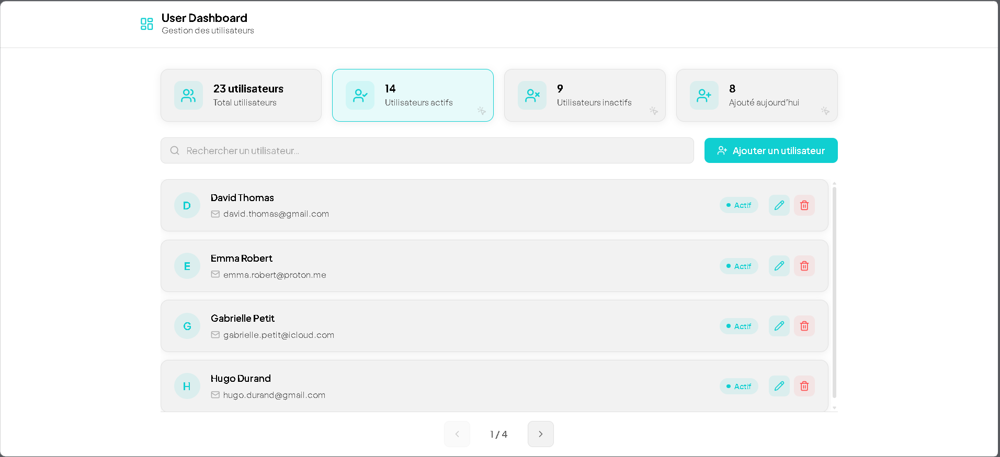
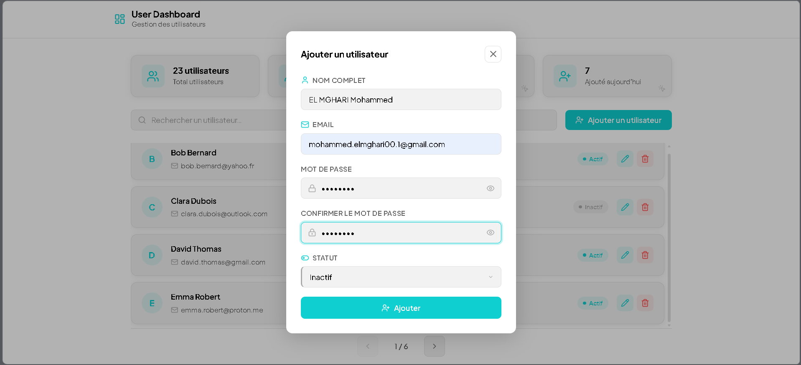
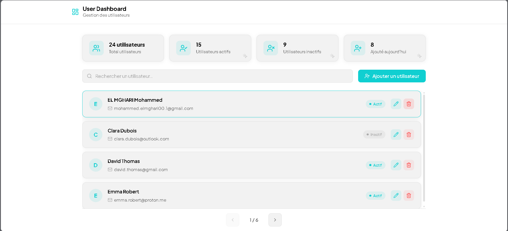
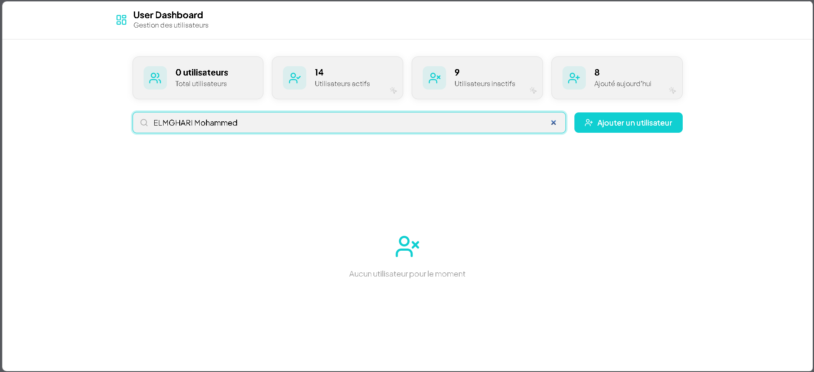
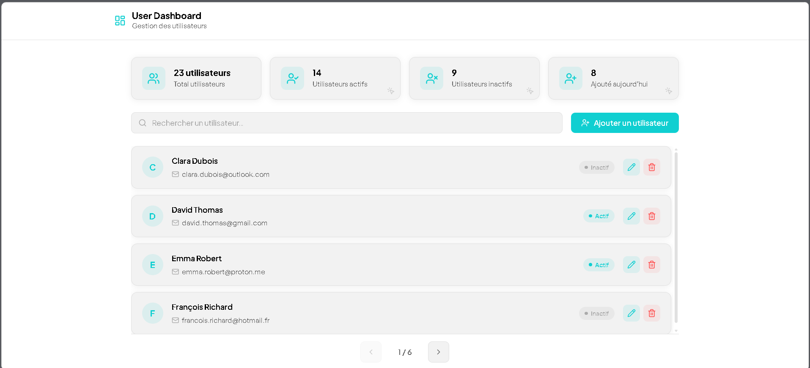

# User Dashboard — Seomaniak 2026


Application de gestion d'utilisateurs : ajout, modification, suppression, filtres et recherche — persistance localStorage.

---

## Stack

| Outil | Version | Rôle |
|---|---|---|
| **React** | 18 | UI library |
| **Vite** | 5 | Bundler + dev server (HMR) |
| **lucide-react** | latest | Icônes tree-shakeable |
| **CSS Modules** | — | Styles scopés, zéro collision |
| **prop-types** | latest | Validation des props en développement |

---

## Installation

```bash
npm install
npm run dev
```

```bash
npm run build    # build production → dist/
npm run preview  # vérification du build
```

---

## Structure

```
src/
├── components/
│   ├── PasswordField.jsx    # Champ mot de passe avec toggle show/hide
│   ├── StatsBar.jsx         # 4 cartes de statistiques cliquables (filtres)
│   ├── StatusSelect.jsx     # Select statut actif / inactif
│   ├── UserCard.jsx         # Carte utilisateur — affichage + edit + delete
│   ├── UserForm.jsx         # Formulaire ajout/modification + validation
│   └── UserList.jsx         # Liste paginée de UserCard
├── hooks/
│   └── useUsers.js          # État users[] + CRUD + sanitisation + localStorage
├── pages/
│   └── Dashboard.jsx        # Composition de page — layout principal
├── styles/
│   ├── index.css            # Variables CSS globales + reset
│   ├── Dashboard.module.css
│   ├── StatsBar.module.css
│   ├── UserList.module.css
│   ├── UserCard.module.css
│   ├── UserForm.module.css
│   ├── PasswordField.module.css
│   └── StatusSelect.module.css
├── App.jsx                  # Entrée unique — rendu Dashboard
└── main.jsx                 # Bootstrap React — StrictMode activé
```

---

## Architecture

```
main.jsx
  └── App.jsx
        └── Dashboard.jsx          ← composition + layout
              ├── useUsers()       ← état global + CRUD + persistence
              ├── StatsBar         ← stats en temps réel + filtres actif/inactif/today
              ├── UserList         ← pagination adaptive + filtreOverride + recherche
              │     └── UserCard   ← React.memo — affichage + edit + delete
              ├── UserForm (add)   ← modale ajout
              └── UserForm (edit)  ← modale modification (initialData)
```

**Flux de données :**

```
useUsers()
  ├── addUser(rawData)     → nettoyerInput() → setUsers() → saveUsers()
  ├── updateUser(id, raw)  → nettoyerInput() → setUsers() → saveUsers()
  └── deleteUser(id)       → filter()        → setUsers() → saveUsers()
```

**Filtrage :**
1. `filterOverride` (stat card active) appliqué en premier — `actif` / `inactif` / `today`
2. `searchQuery` appliqué ensuite — recherche sur nom et email
3. Pagination recalculée sur le résultat final

---

## Sécurité

### Sanitisation XSS

Tout texte entrant est nettoyé dans `useUsers.js` avant tout `setState` :

```js
const nettoyerInput = (valeur, longueurMax = 100) =>
  String(valeur)
    .replace(/<[^>]*>/g, '')      // supprime les balises HTML
    .replace(/[<>"'`]/g, '')      // supprime les caractères dangereux
    .trim()
    .slice(0, longueurMax);
```

- `dangerouslySetInnerHTML` absent de tout le code
- IDs générés avec `crypto.randomUUID()` — jamais `Math.random()`
- Validation déclenchée sur `onBlur` dans `UserForm` — le formulaire ne soumet pas si invalide
- Status whitelisté via `normaliserStatus()` — seuls `'actif'` et `'inactif'` acceptés

---

## Captures d'écran

### Liste filtrée — utilisateurs actifs


### Création d'un utilisateur — EL MGHARI Mohammed


### Affichage et suppression de l'utilisateur créé


### Recherche de l'utilisateur supprimé


### Liste complète des utilisateurs

